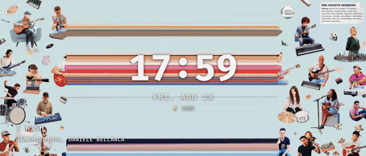
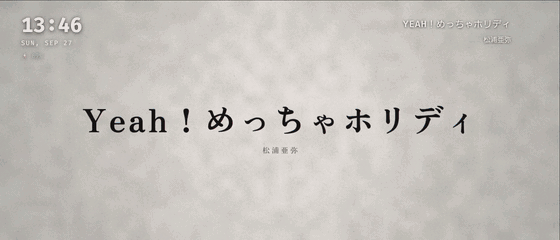

# StaaaaandBy

[English](README.md)

iPhoneのスタンバイモードに着想を得たAndroidアプリ。Qi充電中、ロック画面の上に時計と再生中の曲のジャケットを映します。曲に時刻つきの歌詞があれば、代わりにリリックビデオを流します。



## リリックビデオ（v1.1.0）

設定画面で **同期歌詞があればリリックビデオを表示** をオンにします。StaaaaandByは曲ごとに [LRCLIB](https://lrclib.net)（公開・キー不要のコミュニティDB）に曲名・アーティスト・曲の長さで時刻つき歌詞を問い合わせます。見つかると、スリットスキャンのジャケットの代わりに、852waさんの文字PVエンジン [JIZURA](https://github.com/852wa/JIZURA) が描くリリックビデオを、同梱の `assets/lyric/` からWebViewで流します。見た目は曲ごとにシードされるので、同じ曲はいつも同じ始まり方をします。同期歌詞のない曲はこれまで通りジャケットを表示します。タップ領域は変わりません（左＝前 / 中央＝再生・一時停止 / 右＝次）。歌詞の表示中は時計が左上、曲名とアーティストが右上に小さく寄ります。縦横どちらにも対応: ページがJIZURAに画面の正確な比率（Flipでは縦3:7、横7:3）を教えるので、黒帯なしで画面いっぱいになります。JIZURA自身のHUD（タイトルバー、タイムコード、歌詞カウンタ）はオフ、ぼかしフィルタとグローもオフです。Galaxy Z Flip7のWebViewではそれらが1フレーム60〜140msかかり、外すと110fps以上で動きます。



Saqooshaさんの [jizura-sync](https://github.com/Saqoosha/jizura-sync) を下敷きにしており、LRC→JIZURA変換はそのまま使っています。フォントはGoogle Fontsから随時読み込むので、インストール後の最初の曲は本来の見た目になるまでネットワークが要ります。

## UI

- ジャケットを画面の高さいっぱいに描き、**再生位置に対応する縦1列を横に引き伸ばして（スリットスキャン）** 余った幅を埋めます。スリットは毎フレーム再生位置を追います（サブピクセル描画）
- 縦向き（オプトイン）では同じことを縦方向に行います。ジャケットを幅いっぱいに描き、再生位置の横1行を下に引き伸ばすので、曲が進むとスリットが上から下へ動きます
- 高解像度のジャケットは `ALBUM_ART_URI` から非同期で取り、メタデータ内の低解像度ビットマップと差し替えます
- 見えないタップ領域が画面を3分割: 左＝前の曲 / 中央＝再生・一時停止 / 右＝次の曲
- 時計・日付・バッテリーはジャケットの上に影つきで重ねます。書体は **Fira Code**（可変フォント。時計はBold、ラベルはMedium）、日付は英語表記（`THU, AUG 28`）
- 曲名とアーティストは左下。長い文字列は領域内でマーキースクロールします（影が切れないよう余白つきでクリップ）
- 起動直後の縦向きの1フレームは黒で隠し、横向きになってから700msでフェードイン
- 設定画面（MainActivity）は文字列リソース化してあり、日本語と英語に対応。インストール済みの音楽アプリを一覧して、バッテリー最適化の除外をワンタップで開けます（「準備」参照）

## インストール

ビルド済みAPKはありません。このアプリは、下敷きにしたプロジェクトと同じく個人利用のためのソースコードです（理由は [リリックビデオ](#リリックビデオv110) と [Spotify Web API](#spotify-web-api任意) を参照）。自分でビルドしてサイドロードしてください:

1. デバッグAPKをビルドし（[ビルド](#ビルド)参照）、スマホにコピーするか `adb install` で直接入れる
2. スマホでAPKを開く。ブラウザやファイルマネージャに「不明なアプリのインストール」の許可が要ることがあります。Play Protectが未知の開発者の警告を出すのはサイドロードでは普通です
3. アプリに表示される3つの準備ステップに従う（下記）

Galaxy Z Flip 7（One UI）でしか試していません。他社製（特にXiaomi/OPPO）はバックグラウンドからのActivity起動の制限が厳しく、バッテリーや自動起動の追加設定が要るかもしれません。報告歓迎。

## 準備（端末側）

1. 通知へのアクセスを許可（音楽表示に必要。時計だけでよければ不要）
2. 「他のアプリの上に表示」を許可（スタンバイ画面を出すのに必須）
3. 音楽アプリを眠らせない設定（下記）
4. Qi充電パッドに横向きに置く。充電中にサイドキーで画面を消しても出ます

好みの設定（設定画面の下）: **ケーブル充電でも表示する**（Qiだけでなく USB でも）、**縦向きでも表示する**（どの向きでも。縦用レイアウト）。

注: Samsung端末で常駐サービスが殺される場合は、設定 → アプリ → StaaaaandBy → バッテリー → 制限なし にしてください。

### 音楽アプリを眠らせない（他端末での再生）

他の端末で音楽を再生している場合（例: MacのSpotifyをSpotify Connectで）、スマホ側のSpotifyアプリがその再生をMediaSessionに「鏡」として写し、StaaaaandByはそれを表示します。落とし穴: 鏡の間、スマホのSpotifyは音を出していないので、Androidは待機中のバックグラウンドアプリとみなし、メモリ回収で殺すことがあります。そうなると鏡が消え、他端末では音楽が続いているのにジャケットが止まります。

準備の3番目のステップは、端末に入っている対応音楽アプリを一覧し、バッテリー最適化の除外状態を示し、ワンタップでアプリ設定を開きます。各アプリで **バッテリー → 制限なし** を選んでください。Spotifyに限らず、どの音楽アプリにも当てはまります。これで殺される可能性はかなり下がりますが、本当のメモリ不足では落ちることもあります。音楽アプリを開き直せば表示は戻ります。

さらにStaaaaandByは、スタンバイ画面を表示している間、音楽アプリを能動的に生かします: アプリの公開サービス `MediaRoute2ProviderService`（Spotify Connectのためにシステム自身がbindしているもの）に `bindService` で繋ぎっぱなしにし、無ければ `MediaBrowserService`（Android Autoが使う入口）に繋ぎます。前面アプリからbindされたプロセスはバックグラウンド扱いにならないので、Samsungの夜間「自動最適化」の対象外になり、もし死んでもbindがすぐ起こします。

もうひとつの故障モードがあります: スマホのSpotifyは生きているのに、Connectの鏡が静かに同期を失う。最後に見た状態（たいてい「一時停止」）を報告し続け、Macでは音楽が進んでいる。見張り（watchdog）が15秒ごとにセッション状態をログに残し、怪しいセッションに印を付けます（「再生中」なのに外挿した位置が曲の終わりを超えている、または以前に他端末を写していたセッションが30秒以上「一時停止」のまま。他端末かどうかは `AudioManager.isMusicActive()` で判定: 再生中なのにこの端末から音が出ていない）。すべて logcat の `StaaaaandBy` タグに出ます。

実機で測った事実: **他端末の再生が10分止まると、Spotifyは鏡を畳み**、直後にスマホ自身の古いローカル状態（別の曲、昔の位置で一時停止）をセッションとして出し直します。さらに悪いことに、同期の切れた鏡に `play` を送っても他端末は再開せず、**Connectの再生権がスマホに移ります**（他端末が黙り、スマホから鳴り出す）。v1.0.9からStaaaaandByは両方に備えます: 最後に鏡で流れていた曲を覚え、別の曲で現れ直したセッションを偽物とみなし、疑っている間は **時計だけ** を表示し（曲情報が取れなくなったことが一目で分かる）、タップ操作を無視して再生の乗っ取りを防ぎます。他端末で、あるいはスマホで意図的に再生が始まった瞬間に、表示は自動で戻ります。

鏡は畳まれずに死ぬこともあります: セッションは同じ曲のまま、他端末では再生が続いているのに突然「一時停止」を報告する（2026-09-04に実測、再生開始から約6分）。本当の一時停止と区別がつかないので、v1.0.10から見張りの「鏡セッションが30秒以上一時停止」の判定でも **時計だけ** の表示に切り替え、タップを無効にします。他端末での本当の一時停止が30秒を超えても同じ見た目になりますが、再生が再開した瞬間に戻ります。時計だけの表示中はどこをタップしてもStaaaaandByを閉じて通常のロック画面に戻ります（充電中なら次の画面オフでまた出ます）。v1.0.11からは時計だけの間、画面を5%に減光します。Qi充電だけで電池は約45°Cの充電停止ラインに近づくので、見るものが無い画面で熱を足さないためです。

**それでも表示が固まったら、スマホでSpotifyを一度開いてホームに戻ってください**。SpotifyはUIが前面に来たときにしかConnectの状態を取り直しません。StaaaaandByはこれをわざと自動化していません: ロック中にSpotifyのUIを起動すると半端な起動状態になり、以後、他端末で再生が再開するたびにSpotifyがローカルの音声出力を開き、マルチポイントのBluetoothイヤホンがスマホに奪われます。その自動同期のコードはリポジトリに残っていますが（`AUTO_RESYNC_ENABLED`）、その理由で無効です。

## Spotify Web API（任意）

上で述べたスマホ側のSpotify Connectの鏡が弱点です: 数分で静かに同期が切れ、アプリ側にできることはありません。代わりにStaaaaandByは **Spotify Web API** でアカウントの再生状態を追えます。どの端末で再生していても、Spotifyのサーバーから直接、いま何が流れているかが分かります。[developer.spotify.com](https://developer.spotify.com/dashboard) で自分のSpotifyアプリを作り（Web API。所有者はPremiumが必要）、Redirect URI `staaaaandby://spotify-callback` を登録し、Client IDを設定画面のSpotifyカードに貼って接続します。サインインはAuthorization Code + PKCEなのでクライアントシークレットはありません。トークンはスマホに保存され、Spotify以外には送られません。開発モードのアプリは、User Managementに登録した最大5アカウントで使えます。接続中、スタンバイ画面は1秒ごとに `GET /me/player` を叩き、その間は外挿します。タップ操作はWeb APIを呼ぶので、再生中の端末に対して効き、スマホに再生が乗っ取られることはありません。

両方の機能を一緒に使う前に、Spotifyの [Developer Policy](https://developer.spotify.com/policy) を読んでください。Spotifyの音源を映像と同期させることが禁じられており、曲に合わせたリリックビデオはまさにそれです。これは個人的な実験です。自分のSpotifyアプリを使い、自分のアカウントの範囲にとどめ、サービスとして他人に提供しないでください。歌詞はLRCLIBのコミュニティデータを実行時に取得するもので、このプロジェクトが権利処理や再配布をしているものではありません。

## しくみ

- **ChargingWatchService**（常駐のフォアグラウンドサービス）が「電源接続」と「画面オフ」を見張り、ワイヤレス（Qi）充電中に画面が消えたら、ロック画面の上に **StandbyActivity** を出します（`showWhenLocked` + `turnScreenOn`）。バックグラウンドからのActivity起動は「他のアプリの上に表示」権限（SYSTEM_ALERT_WINDOW）で許されます
- 既定ではケーブル（AC/USB）充電では起動せず、スマホが物理的に横向きに置かれているときだけ起動します（充電中は加速度センサーで向きを見続けるので、あとから横に倒しても出ます）。どちらもアプリの「好みの設定」で変えられます: **ケーブル充電でも表示する** / **縦向きでも表示する**。充電が止まると画面は自動で閉じます
- 再生中の曲情報は **MediaSessionManager** + 通知リスナーから取ります。MediaSessionを使う音楽アプリなら何でも対象で、Spotify専用ではありません
- UIはJetpack Compose。既定は横向き（上下はセンサーで自動判定）、システムバーを全部隠した全画面。縦向きを許可すると全方向センサーに従い、縦用レイアウトに切り替わります

## プライバシー

何も収集しません。通知へのアクセスは音楽アプリのメディアセッション（曲名・アーティスト・ジャケット・再生状態）を読むためだけに使い、通知そのものは読みも保存もしません。INTERNET権限の用途は: ジャケット画像、リリックビデオがオンのときにLRCLIBへ送る、いまの曲と次の曲の曲名・アーティスト・曲の長さ（返ってきた歌詞はアプリのキャッシュ領域に最大300曲ぶん残すので、聴いたことのある曲はネット不要）、リリックビデオのページが行うGoogle Fontsへのリクエスト、そして自分のSpotifyアプリを接続した場合に限りSpotify Web API（トークンはスマホに保存され、`accounts.spotify.com` / `api.spotify.com` にしか送られません）。このプロジェクト自身のサーバーはありません。

## ビルド

- JDK 17 と Android SDK（compileSdk 35）が必要。`gradle.properties` の `org.gradle.java.home` は Homebrew の `openjdk@17` を指しています
- `./gradlew :app:assembleDebug` → `app/build/outputs/apk/debug/app-debug.apk`
- リリースビルド（`assembleRelease`）は `keystore.properties`（リポジトリ外）で指定した鍵で署名します。無ければデバッグビルドを使ってください

## ライセンス

- コード: [MIT](LICENSE)
- 同梱の [Fira Code](https://github.com/tonsky/FiraCode) フォントは SIL Open Font License 1.1 — [licenses/FiraCode-OFL.txt](licenses/FiraCode-OFL.txt)
- 同梱のリリックビデオエンジン [JIZURA](https://github.com/852wa/JIZURA)（`app/src/main/assets/lyric/jizura/`）は © 852wa、MIT — [licenses/JIZURA-MIT.txt](licenses/JIZURA-MIT.txt)。`assets/lyric/lrc.js` は [jizura-sync](https://github.com/Saqoosha/jizura-sync)（MIT、Saqoosha）から

## 構成

```
app/src/main/java/com/kazuto/standby/
├── MainActivity.kt                     # 設定画面（権限 / 音楽アプリのバッテリー / 好みの設定 / Spotify）
├── Prefs.kt                            # ユーザー設定（ケーブル起動、縦向き、リリックビデオ、Spotifyトークン）
├── StandbyActivity.kt                  # ロック画面の上に出すスタンバイ画面。再生状態の供給元を選ぶ
├── service/ChargingWatchService.kt     # 常駐の充電/画面監視 → StandbyActivity を起動
├── service/BootReceiver.kt             # 再起動後にサービスを立ち上げ直す
├── media/PlaybackSource.kt             # スタンバイ画面が表示・操作するもの（再生中の StateFlow + 操作）
├── media/NowPlayingListenerService.kt  # MediaSession へのアクセスに必要な通知リスナー（中身は空）
├── media/MediaSessionWatcher.kt        # 端末の MediaSession からの PlaybackSource。鏡切れの見張り
├── media/MusicAppKeepAlive.kt          # スタンバイ表示中に音楽アプリのプロセスを生かす（bindService）
├── spotify/SpotifyAuth.kt              # Spotify サインイン（PKCE）と Web API 呼び出し
├── spotify/SpotifyWebPlayer.kt         # GET /me/player を1秒ごとに叩く PlaybackSource
├── lyrics/LyricsRepository.kt          # 再生中の曲の同期歌詞（LRC）を LRCLIB から
├── ui/StandbyScreen.kt                 # Compose UI: スリットスキャンまたはリリックビデオ + 時計の重ね描き
└── ui/LyricVideo.kt                    # assets/lyric（JIZURA）を動かす WebView。曲と再生位置の基準点を渡す
app/src/main/assets/lyric/              # リリックビデオのページ: index.html、lyric.js（駆動）、lrc.js（LRC→JIZURA）、jizura/（エンジン）
```
